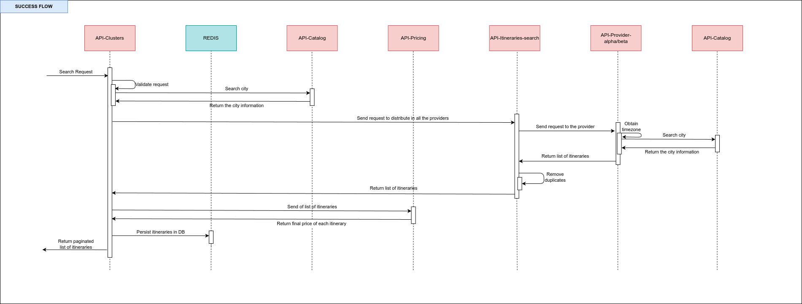
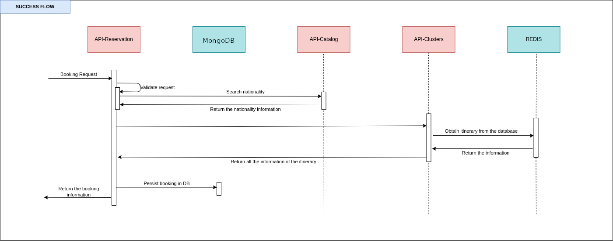

# Thrive EdSchool - Course: API Testing with Karate

[](https://opensource.org/licenses/MIT)

This repository contains the code of the course "API Testing with Karate"

## Table of contents

The following are the most important topics in this file:
- [Requirements](#Requirements)
- [Check requirements](#check-requirements)
- [Architecture](#Architecture)
    - [Microservices](#Microservices)
    - [Flow](#Flow)
      - [Searching](#Searching)
      - [Booking](#Booking)
- [Run the APIs](#run-the-apis)
- [Documentation of APIs](#documentation-of-apis)
- [Considerations](#Considerations)

## Requirements

To use these microservices you need to have in your machine the following things:
- [Java](https://www.oracle.com/ar/java/technologies/downloads/)
- [Maven](https://maven.apache.org/)
- [Git](https://git-scm.com/)
- [Docker](https://www.docker.com/)

If you don't have some of these tools in your machine installed, please follow the instructions in the official documentation of each tool.

## Check requirements

If you have installed on your machine some of these tools previously or you installed all the tools now, please check if everything works fine.

- Check which version of Java you have using the following command:
   ````
   % java -version
  openjdk 21.0.2 2024-01-16
  OpenJDK Runtime Environment GraalVM CE 21.0.2+13.1 (build 21.0.2+13-jvmci-23.1-b30)
  OpenJDK 64-Bit Server VM GraalVM CE 21.0.2+13.1 (build 21.0.2+13-jvmci-23.1-b30, mixed mode, sharing)

   ````
  
- Check whether your Maven version is 3.8.3 or up. You can see which version of Maven you have using the following command:
   ````
   % mvn --version
   Apache Maven 3.9.1
   Maven home: /usr/share/maven
   ````
  
- Check whether the version of Docker in your machine is 25.0.0 or higher. You can check the version of Docker using the following command:
   ````
   % docker --version
   Docker version 27.4.1, build b9d17ea
   ````
  
- Check if Git is installed correctly on your machine using the following command:
   ````
   % git --version
  git version 2.34.1
   ````

## Architecture

The microservices are an abstraction of all the flow of a travel agency reducing the scope to the search and book operations. 

#### Microservices

The system comprises the following microservices:
* **api-catalog** is a microservice containing all information about which are the valid cities to find flights. This API only returns a certain amount of flights that are required in the request, to get the next page of results without doing a new search, all the results will save it in a database with a TTL.
* **api-clusters** is a microservice containing all the validations about the parameters of the search. Also, call **api-pricing** to get the final price of each itinerary.
* **api-pricing** is a microservice containing all the rules to add a markup of each itinerary and calculate the final price of each of them.
* **api-itineraries-search** is a microservice containing all logic, of which providers need to call to get all the itineraries. Also, this microservice removes duplicates.
* **api-provider-alpha** is a microservice that simulates to get the information of an external provider.
* **api-provider-beta** is a microservice that simulates to get the information of an external provider.
* **api-reservation** is a microservice save the information about a book of a particular itinerary.

#### Flow
This section will show you the two different flows that have the platform. The first flow is about obtaining all the itineraries to book one; the second one takes one of the itineraries and creates a reservation validating specific values.

##### Searching
The flow of each request to search has the following steps:
1. **API-Clusters** receive a request and validate common information like the number of passengers and the distribution of them, the departure date, and some other information.
2. **API-Clusters** do a request of each city to validate the existence of that city.
3. **API-Clusters** do a request with all the information related to the search to **API-Itineraries-search**.
4. **API-Itineraries-search** find all the providers and do a request with the same information that they receive it.
5. Each provider gets all the itineraries that match the conditions of the request. Also, each provider does several requests to get the timezone of each city and with this information calculate the duration of each flight.
6. **API-Clusters** send all the itineraries to **API-Pricing** to get all the information about the markup of each flight and which is the final price.
7. **API-Clusters** save the entire responses for a brief period in the Redis database because the search is paginated, so **API-Clusters** use the database to prevent do the same search again just to get the next page the result.

The following picture illustrates the flow described above.


Also, you can see the flow with more detail in this picture:


##### Booking
The flow of each request to book has the following steps:
1. **API-Reservation** receive a request and validate common information before to check some information that exist in another microservices.
2. **API-Reservation** do a request to **API-Clusters** to validate if the itinerary_id exists or not in the database.
3. **API-Reservation** do a request to **API-Catalog** to validate if the nationality of the passengers exists or not.
4. **API-Reservation** persist the information into the database.


The following picture illustrates the flow described above.


Also, you can see the flow with more detail in this picture:


## Run the APIs

To run API, please follow these steps:
1. Clone the repository using this command **git clone REPOSITORY_NAME**
2. Open a terminal in the directory of the API and run **docker-compose build** and  **docker-compose up** all the components run together.
3. If everything works fine, open a web browser in the URL which appears in the documentation section.

If you have any doubt about the status of the microservices, you can open another terminal in the root directory of the code and run **docker ps**, this command will show you which port the different container expose, the status (up, down), and the names.

## Documentation of APIs

Each API has documentation to understand which parameters are required and the URL to invoke them. To see the API documentation is necessary to run each project and access to:
- [Swagger - Reservation](http://localhost:3070/api/flights/reservation/documentation)
- [Swagger - Clusters](http://localhost:4070/api/flights/clusters/documentation)
- [Swagger - Pricing](http://localhost:5070/api/flights/pricing/documentation)
- [Swagger - Catalog](http://localhost:6070/api/flights/catalog/documentation)
- [Swagger - Itineraries Search](http://localhost:7070/api/flights/itineraries-search/documentation)
- [Swagger - Provider Alpha](http://localhost:8070/api/flights/provider/alpha/documentation)
- [Swagger - Provider Beta](http://localhost:9070/api/flights/provider/beta/documentation)


Optionally you can use [**Postman**](https://www.postman.com/) or [**Insomia**](https://insomnia.rest/) to do the request from the different microservices, the repository includes a collection of each tool with all the endpoints.

## Considerations

To run all the microservices in the same machine, you need to consider that the following ports need to be available to use it:

| Name                   | Application | Database    |
|------------------------|-------------|-------------|
| api-reservation        | 3070        | 5079        |
| api-clusters           | 4070        | 6079        |
| api-pricing            | 5070        | 3010        |
| api-catalog            | 6070        | 3011        |
| api-itineraries-search | 7070        | ---         |
| api-provider-alpha     | 8070        | ---         |
| api-provider-beta      | 9070        | ---         |

Consider that the number of microservices depends on which version of the dockerfile you run.